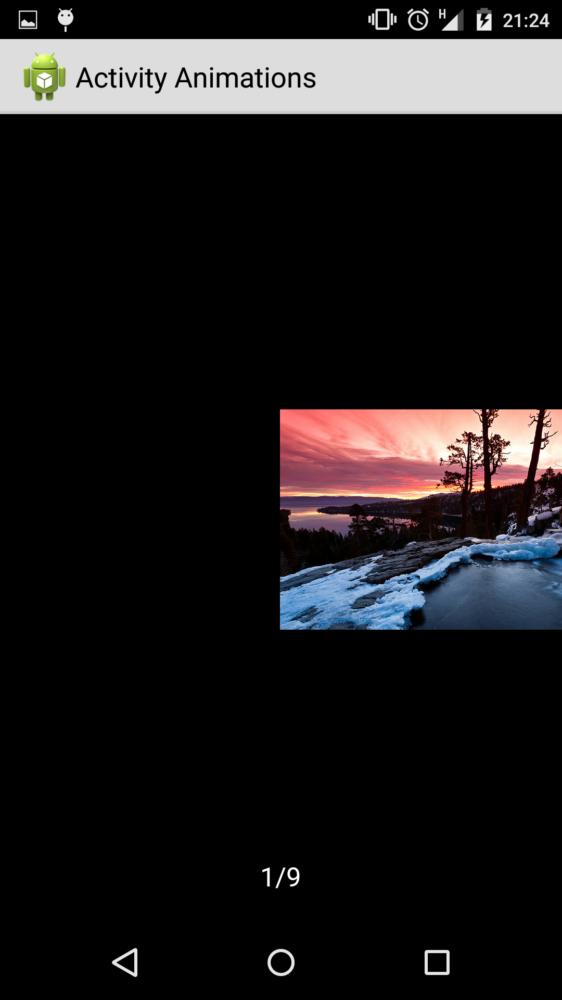

# ImageBrowse fragment can use to browse image with transition animation

The same as the latest android WeChat moments image browse effect 

[](https://android-arsenal.com/details/1/2573)
# FINAL EFFECT


# REBOUND EFFECT


 Feature:
  New add padding and margin support in ImageBrowseFragment

    1.original view: just like normal imageview but with zoom effect
    2.detail view:
    ① single click back to pre layout with shrink effect
    ② double click to zoom effect(*2.5)
    ③ more gesture see details code
    3.if u have more than one imageview can display with ViewPager
    random click original imageview,and scroll ViewPager to any position,
    than u press back key,or single click detail,u will see original view's
    position is the same as ViewPager‘s current position.

    4.load image from remote u can't click item until it finished

    5.ViewPager has rebound effect when edge of ViewPager is available..

#USAGE for fragment
  
1.Handle init PhotoView(also available xml)

  ```java

      PhotoView p = new PhotoView(MainActivity.this);
      p.setLayoutParams(new AbsListView.LayoutParams((int) (getResources().getDisplayMetrics().density * 100), (int) (getResources().getDisplayMetrics().density * 100)));
      p.setScaleType(ImageView.ScaleType.CENTER_CROP);
      p.setEnabled(false);//u can't click view until image load completed
      ...//load image and put it into PhotoView
      p.disenable(false);//disable touch
  ```
2.Handle PhotoView Click
  
   ```java

       //view is PhotoView normally,when load inmage from remote,you need call view.enable() to 
       //let PhotoView can't be clicked util it load completed
       if(view.isEnabled()) { 
       Bundle bundle = new Bundle();
       bundle.putStringArrayList("imgs", imgList);//all PhotoView url(remote)
       bundle.putParcelable("info", ((PhotoView) view).getInfo());//click PhotoView ImageInfo
       bundle.putInt("position", position);//click position
       imgImageInfos.clear();
       //NOTE:if imgList.size >= the visible count in single screen,i will cause NullPointException
       //because item out of screen have been replaced/reused
       for (int i = 0; i < imgList.size(); i++) {
           imgImageInfos.add(((PhotoView) parent.getChildAt(i)).getInfo());//remember all PhotoView ImageInfo
       }
       bundle.putParcelableArrayList("infos", imgImageInfos);
       //attach fragment to Window
       getSupportFragmentManager().beginTransaction().replace(Window.ID_ANDROID_CONTENT, ImageBrowseFragment.getInstance(bundle), "ViewPagerFragment")
                                   .addToBackStack(null).commit();
       }

   ```
   
   More detail please see demo code.
   
#USEAGE for **Dialog** fragment
 
 1.set dialog framgent and flag something
 ```java
   
     @Override
    public Dialog onCreateDialog(Bundle savedInstanceState) {
        return new Dialog(getActivity(), IdentifierUtil.getStyleId(getActivity(), "DialogTheme"));
    }
    @Override
    public void onActivityCreated(Bundle savedInstanceState) {
        super.onActivityCreated(savedInstanceState);
        getDialog().getWindow().addFlags(WindowManager.LayoutParams.FLAG_FULLSCREEN);
        getDialog().getWindow().setLayout(WindowManager.LayoutParams.MATCH_PARENT, WindowManager.LayoutParams.MATCH_PARENT);
    }
 
 ```
 
 ```xml
 
    <style name="DialogTheme" parent="CCDHDSecondDialogFragmentTheme">
        <item name="android:windowAnimationStyle">@null</item><!--animation must be null -->
        <item name="android:backgroundDimEnabled">false</item>
    </style>
 
 ```
 2.Inside **Info.class** you need have a method like
 ```java
 
  public void correct(int[] position){
        mRect.left = mRect.left + position[0];
        mRect.right = mRect.right + position[0];
        mRect.top = mRect.top + position[1];
        mRect.bottom = mRect.bottom + position[1];

        mLocalRect.left = mLocalRect.left + position[0];
        mLocalRect.right = mLocalRect.right + position[0];
        mLocalRect.top = mLocalRect.top + position[1];
        mLocalRect.bottom = mLocalRect.bottom + position[1];

        mImgRect.left = mImgRect.left + position[0];
        mImgRect.right = mImgRect.right + position[0];
        mImgRect.top = mImgRect.top + position[1];
        mImgRect.bottom = mImgRect.bottom + position[1];

        mWidgetRect.left = mWidgetRect.left + position[0];
        mWidgetRect.right = mWidgetRect.right + position[0];
        mWidgetRect.top = mWidgetRect.top + position[1];
        mWidgetRect.bottom = mWidgetRect.bottom + position[1];
    }
 
 ```
 And correct the location when you pass the preoImgInfo,It's where you
 click pre PhotoView,add following code
 ```java
         int[] position = new int[2];
         root.getLocationOnScreen(position);//root just the root view of current fragment or activity
         Info preImgInfo = bundle.getParcelable("preImgInfo");
         preImgInfo.correct(position);//Note this must be invoke or the animation not fluent
         bundle.putParcelable("preImgInfo",preImgInfo);
         ArrayList<Info> imageInfos = bundle.getParcelableArrayList("imgInfos");
         for (Info item : imageInfos) {
             item.correct(position);//Note this must be invoke or the animation not fluent
         }
         bundle.putParcelableArrayList("imgInfos",imageInfos);
         ImageBrowseDialogFragment.newInstance(bundle).show(getFragmentManager(),ImageBrowseDialogFragment.class.getSimpleName());
 
 ```
 
 3.The left is same as fragment usage...

#NOTE
 **if you use ReboundViewPager to get rebound effect,this way may cause a problem when doing scale operation at first or last PhotoView 
 try use ViewPager instead**
 

#THANKS
PhotoView from https://github.com/bm-x/PhotoView

Custom Activity Animations from https://www.youtube.com/watch?v=CPxkoe2MraA

## License

Copyright 2015-2016 Bruce too

Licensed under the Apache License, Version 2.0 (the "License");
you may not use this file except in compliance with the License.
You may obtain a copy of the License at

    http://www.apache.org/licenses/LICENSE-2.0

Unless required by applicable law or agreed to in writing, software
distributed under the License is distributed on an "AS IS" BASIS,
WITHOUT WARRANTIES OR CONDITIONS OF ANY KIND, either express or implied.
See the License for the specific language governing permissions and
limitations under the License.

See [LICENSE](LICENSE) file for details.
